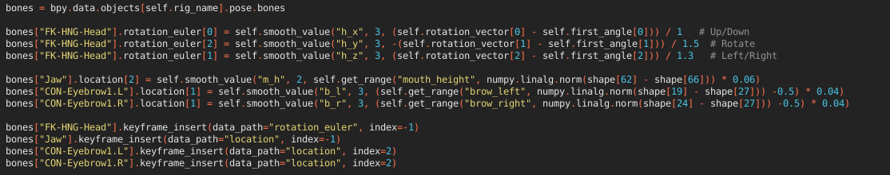
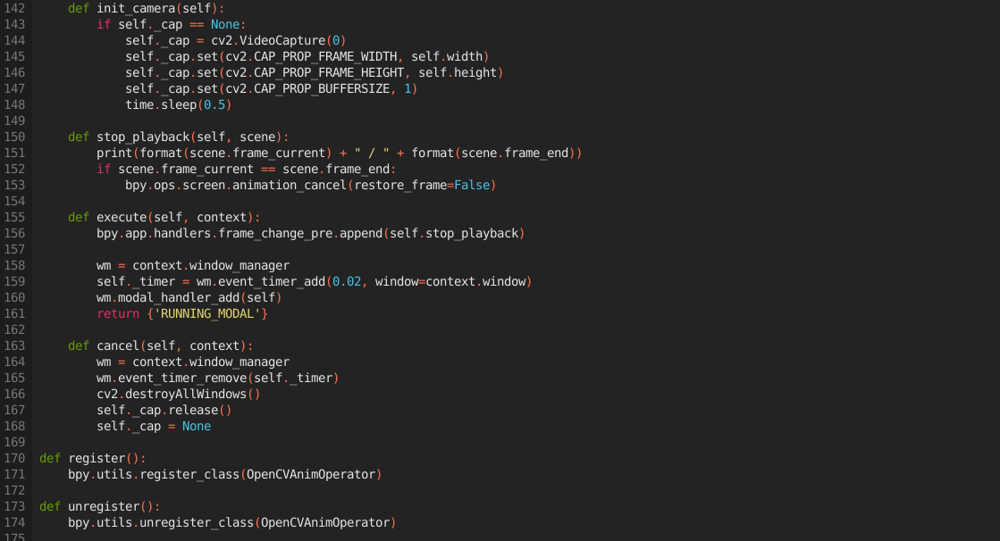

# Facial Mapping Using Blender and Python

## Setup

In order to run this program and animate a rigged object, you will need an installation of blender as well as a couple of modules that we will outline how to install in this section. In order to install these modules, you must first locate the python installation for blender. You can do this by running the following commands in the terminal of the scripting tab in blender:
<br />
<br />

```python
import sys
sys.path
```


<hr />

This gives the path to the installation of python for your blender enviroment. Naviate to the lib directory in the python folder and make sure pip is installed. You can do this by running the following commands:

```powershell
python3.10 -m ensurepip
python3.10 -m pip install --upgrade pip --user
```

Once pip is installed you will need a the opencv, numpy, and dlib packages. Fun the following command to install these packages:

```
python3 -m pip install opencv-python opencv-contrib-python imutils numpy dlib --user
```

Once you import the blender file from the repo, it will aready have the scripts saved in the .blend file. Alternatively you can download the scripts seperately to use with another model and use the following steps to import them into your project. Import the python scripts using the open script button on the top of the text editor window (icon of the file folder next to the name of the text file) and facial mapping predictor from the repo (you can save this file anywhere on the computer, just make sure you know its location) Then make sure the rig_name variable matches the name of your object in the scene graph and alter the variables described below to match your model.
<br />
<br />
***Note: Regardless of how you download and import the scripts make sure you go into the file and change variable p in the OpenCVAnimOperator class to point to where you saved your *shape_predictor_68_face_landmarks.dat* file so the script can locate it.***
<br />
<br />
**You are now ready to start animation using your webcam capture**

## Code Explaination

This section will go through the provided code so that you can understand what it is doing to capture your face.
<br />
<br />
The file *AnimationButton.py* adds an icon in the scene layout so you can easily begin capturing your webcam for the purporse of animation, the meat of the code lies in *Animation-[selected rig].py\**.

\* *You can choose between either the Vincent or Snow models which are provided.*
<br />
<br />
*Animation-[selected rig].py* Uses a class, AnimationRunner, which contains all of the necessary functions. It starts by assigning variables for the blender icon, the rig name, predictor dataset, the facial detector, the model points, and the camera matrix. If you wanted to use this script for other rigged models, you would need to change the rig name and the model points to match with the model you would like to use.

This is what we did to adapt the AnimationRunner to the Snow model.



The code above is from *Animation-Snow.py*. You'll notice that the names of the bones we are querying from the bones collection are different as well as the indicies of their locations. This is to ensure that the script knows which bones to move on the Blender model and which joints to move or rotate. From there we may need to adjust some of the linear algebra to make sure we are seeing the proper transformations on the rig that correspond to our head movements.

### Functions

##### Smooth Value

The smooth value function keeps a running average of the length value between points. This smooths out the movement of the animated face so that it looks less choppy and more natural.


##### Get Range

Get range compresses distance values between 0 and 1 so that you can keep movements between a particular range and avoid unnatural facial expressions by points moving too far away from each other.


##### Modal

The modal function is where all the work for animating the face lies. It starts with 2 event handlers checking if the animation program is supposed to be running, if it isn't the window closes and the program stops, but if it is then it continues with the function.


##### MISC. Functions

The rest of the functions are utility functions for the camera. These will help clean up the capture window used by OpenCV and will also run the script when the UI button in Blender is pushed.



## Results

